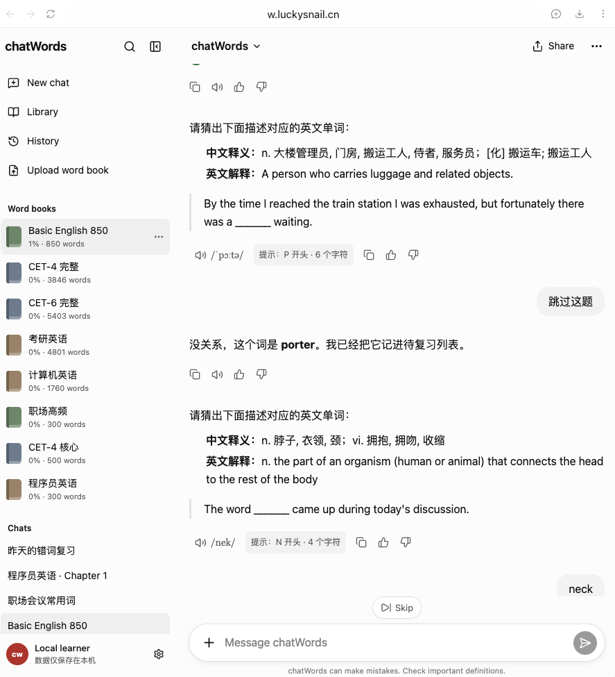

# chatWords

一个藏在聊天页面里的本地背单词工具。AI 会给出中文释义、英文解释和挖空例句，你只需要像聊天一样，在输入框里猜出对应的单词。

[在线体验](https://chatwords.snailrun160.workers.dev/?ui=c62ff50c)



## 功能亮点

- 8 个内置词本：职场高频、CET-4 核心、程序员英语、Basic English 850、CET-4 完整、CET-6 完整、考研英语、计算机英语
- 聊天式练习：根据释义和挖空例句猜单词
- 支持发音、错误提示、跳过和练习完成总结
- 支持 CSV / JSON 自定义词本导入、预览和校验
- 学习进度保存在浏览器本地，无需注册账号
- 支持浅色、深色主题和移动端布局

## 本地运行

需要 Node.js 和 pnpm：

```bash
pnpm install
pnpm dev
```

浏览器打开 [http://localhost:3000](http://localhost:3000) 即可使用。

常用命令：

```bash
pnpm test       # 运行测试
pnpm lint       # 检查代码规范
pnpm typecheck  # 检查类型
pnpm build      # 构建生产版本
```

## 自定义词本

在页面中打开 **Upload word book**，可以上传 CSV 或 JSON 文件，也可以直接下载 CSV 模板。

CSV 格式：

```csv
word,zh,en,example,phonetic,audio,aliases
abandon,放弃,to leave something completely,I ___ the old plan.,/əˈbændən/,,give up
```

其中 `word`、`zh`、`en`、`example` 为必填字段；多条释义或别名可以使用 `|` 或 `；` 分隔。

## 部署到 Cloudflare Workers

项目基于 Next.js 和 `@opennextjs/cloudflare`：

```bash
pnpm cf:build
pnpm cf:preview
npx wrangler whoami
pnpm cf:deploy
```

## 致谢

- 感谢[网易有道翻译](https://fanyi.youdao.com/)提供优秀的翻译与语言学习服务。
- 感谢 [Qwerty Learner](https://github.com/RealKai42/qwerty-learner) 开源项目带来的灵感与参考。

## 开源许可

本项目基于 [MIT License](LICENSE) 开源。
